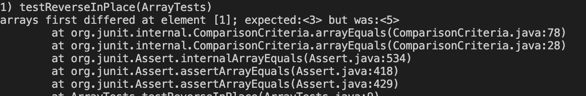

**LabReport2**

**-PartA**<br>


**-PartB**
<br> 1. ```static void reverseInPlace(int[] arr)```<br>
I wrote test like this:
 ```
public void testReverseInPlace() {
    int[] input1 = { 3,5 };
    ArrayExamples.reverseInPlace(input1);
    assertArrayEquals(new int[]{ 5,3} , input1);
	}
```
The Symptom: 

The Bug:
```
arr[i] = arr[arr.length - i - 1];
```
When the void changes the array order, it removes the original element. 

Fix:
 To fix the error, we need to make a new array and save the original array. After reversing the array in the new array, we need to copy the new array to the original array. 
```
static void reverseInPlace(int[] arr) {
      
      int tempNewArray[] = new int[arr.length];
  
      for(int i =0; i < arr.length; i++) {
        tempNewArray[i] = arr[i];
      }
  
  
      for(int i = 0; i < arr.length; i++) {
       tempNewArray[i] = arr[arr.length-1-i];
  
      }
      for(int i =0; i < arr.length; i++) {
        arr[i]=tempNewArray[i];
      }
    }
```
In the new fixed code, I made tempNewArray[i] and save the reverse array. After reversing the array, 
I copied tempNewArray to arr. 
```
arr[i]=tempNewArray[i]
```


